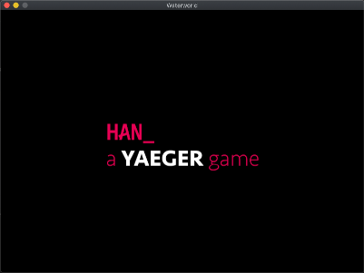
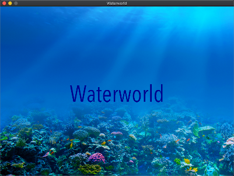

# Yaeger tutorial: Creating Waterworld
In this tutorial you will create a simple game called Waterworld. We start of with an empty project that 
does not contain any code. Only the assets and the project settings are provided. Step-by-step you will 
be guided in the creation of simple game, and in doing so, become familiar with many of the features of 
Yaeger.

## Requirements
Yaeger requires Java JDK12 or above to work, and can be used with any IDE that supports Java.

# Creating your first Yaeger Game
We are going to create a game that consists of three **Scenes**. A Title Scene, a GameLevel Scene and a Game Over Scene.
The Game itself will be about a fish called Hanny, that swims in the ocean and tries to pop air bubbles. Sadly most bubbles
contain a poisonous gas and popping to many of those kills Hanny.
But not only Hanny swims in the Ocean, but also an evil Shark. If he gets his hands on Hanny, Hanny gets eaten.

## Clone the starter project
We provide a repository, that contains both a starter project and the required assets. Either clone this repository
to your local machine, or download the zip file.

The project is a Maven project, which will be recognized by all modern IDE's. Knowledge of Maven is therefore not required.
But just to paint the full picture, you'll find a `pom.xml` file at the root of the project. This file contains the full
project setup and you will notice the dependency it has on `Yaeger`. 

### Switch Branch to look at the solution
Whenever your stuck, you can switch to Branch *implementation*, to see the full implementation.
 
### Importing the project in IntelliJ

### Importing the project in Eclipse

## Create the entry-point of Waterworld
Let's first create the entry-point, the Class that contains the `main`-method.

:computer: Create a Class called `Waterworld.java` in the package `com.github.hanyaeger.tutorial`.

:computer: Let `Waterworld` extend the Class `YaegerGame`and implement the required methods. Leave them empty for now.



:computer: Add a `main`-method that calls the static method `launch()` from the class `YaegerGame`. Pass the arguments from the `main`-method
to the `launch`-method:
```java
    public static void main(String[] args) {
        launch(args);
    }
```

:arrow_forward: You now have a minimal Yaeger game. Run the `main`-method to start the game. As you will
notice, there is a default width and height and you'll be greeted with the
Splash Screen. Since no Scenes have been added, Yaeger exits after showing this SplashScreen.

## Set the width, height and title of the game
The game now uses the default size (width/height), which might be a bit small. You can use the method `setupGame()` to 
set the size to a specific value. Furthermore you can set the title of the game, which will be shown as the title of the window.

:computer: Add the following body to the `setupGame()` method
```java    
    @Override
      protected void setupGame() {
          setGameTitle("Waterworld");
          setSize(new Size(800, 600));
      }
```
## Add a title/welcome screen
We're going to add the first Scene to the game. Yaeger supports two different types of Scenes. 
A `StaticScene` and a `DynamicScene`. A `StaticScene` will have no Game World update and should be used for Scenes
in which nothing should move or be animated. A `DynamicScene` does receive a Game World update and should be 
used for Game Levels, or Scenes that contain animated elements. Since nothing will have to be animated for the TitleScene, 
it can become `StaticScene`.

### Add the TileScene
:computer: Create a new Class called `TitleScene` that extends `StaticScene` in the package `com.github.hanyaeger.tutorial.scenes`.
Implement the required methods, but leave them empty.

### Set the backgound image and audio
The method `setupScene()` should be used for setting the background image and audio of a Scene. For this you
can use the methods `setBackgroundImage(String url)` and `setBackgroundAudio(String url)`. Both the image
and the audio are provided in the `resources/` folder. This folder should be the only place to store your assets.
The url is relative to this folder, so the file `background1.jpg` from the folder `backgrounds/` should be accessed
through the url `backgrounds/background1.jpg`. For the background audio, we will use `ocean.mp3`. 

:computer:  Add the 
following body to the `setupScene()`.

```java
    @Override
    public void setupScene() {
        setBackgroundAudio("audio/ocean.mp3");
        setBackgroundImage("backgrounds/background1.jpg");
    }
```

At this point you should have a look at the file `module-info.java`, which is called the *Module Descriptor*. This is a special file that defines 
(amongst other things) which directories should be opened up. The `resources` folder itself is open by default,
but any subdirectory should be added for the resources in those directories to be available. As you will notice
this has already been done: 
    ```java
        opens audio;
        opens backgrounds;
        opens sprites;
    ```
Do not forget to do this for your own game, or an Exception will be thrown when the game is trying to access 
a resource that is in a directory that has not been opened up.

### Add the scene to the Yaeger Game
Now that we have created the TitleScene, we should add it to the Game. For this, we will use the method `setupScenes()` from `Waterworld.java`.
This method takes two parameters. The first one identifies the Scene, which you can use to set the active Scene. The second parameter is an 
instance of the Scene.

:computer: So add the following body to the `setupScenes()` method:
           
```java
    @Override
    protected void setupScenes() {
        addScene(0, new TitleScene());
    }
```

:arrow_forward: Its time to run the game again. After the Splash Screen has been shown, the TitleScene should be loaded. 

### Add some text to the TitleScene
Lets add the title of the game to the TitleScene. All objects you can add to a Scene are called *Entities*. Of these there 
are various different types. There are *TextEntities* that should be used for dislaying a text, *SpriteEntities* for displaying
a Sprite and shape-based Entities, such as, for instance, a *RectangleEntity*. For all these types there are the Static and Dynamic version.

A title is typically the static version of a `TextEntity`. We will use the method `setupEntities()` to add Entities to the Scene.

:computer: Add the following body to the setupEntities() method:

```java
    @Override
    public void setupEntities() {
        var waterworldText = new TextEntity(new Location(getWidth() / 2, getHeight() / 2), "Waterworld");
        waterworldText.setAnchorPoint(AnchorPoint.CENTER_CENTER);
        waterworldText.setFill(Color.DARKBLUE);
        waterworldText.setFont(HanFont.createDefaultCondensedFont(80));
        addEntity(waterworldText);
    }
```



First we create the `waterworldText` by instantiating a `TextEntity`. The first parameter of the constructor is the `Location`. To
place it at the center of the Scene, we use the `getWidth()/2` and `getHeight()/2`. The second parameter is the text to be shown.
To actually place the center of the `TextEntity` at the center of the Scene, we use the method `setAnchorPoint()` and to set the 
color, we use `setFill()`. We set the font to the HAN font, through the method `setFont()` and lastly we add the `Entity` to the Scene, 
by calling the method `addEntity()`.

:arrow_forward: Run the game again. The TitleScene should now contain the title.

## Add the Game Scene
Now that we have a TitleScene, lets add a Game Level. Since a level is typically a Scene that contains animated Entities, we are going to extend
a `DynamicScene`.

:computer: Add a scene called `GameLevel`, which extends a `DynamicScene`, to the `com.github.hanyaeger.tutorial.scenes` package.
Use the method `setupScene()` to set the background to the asset `background2.jpg` and the audio to `waterworld.mp3`.

At this moment the level has not yet been added to the game. You have only created a new class, that needs
to be instantiated and added to the `YaegerApplication`.

:computer: Use the `setupScenes()` from the `Waterworld`-class to add `GameLevel` to the game. Choose a wise `id`.

### Add a button to switch to the Game Scene
Although `GameLevel` has now been added to the Yaeger Game, there is no way to reach it yet. As said before, the
first added Scene is set as the active scene and that should be the `TitleScene`. To switch to `GameLevel`
you will need to call the method `setActiveScene(id)` on the `Waterworld` class.

To enable this, we are going to add a button to the `TitleScene`. Clicking the button will result in switching to
`GameLevel`. As said before, everything that should appear on a Scene is an Entity. For the button we are going to use
a `TextEntity` that will need to listen to mouse-clicks. Because of the latter, we can no longer use an inline 
`TextEntity` as we did for the title. We are going to create a new Class, called `StartButton` that extends `TextEntity`,
and add all the required behaviour to this Class.

### Create and add the button
:computer: Create a new Class `StartButton` that extends `TextEntity` and place it in the package 
`com.github.hanyaeger.tutorial.entities.buttons`. Use the following constructor:

```java
    public StartButton(Location initialPosition) {
        super(initialPosition, "Play game");
        setFill(Color.PURPLE);
        setFont(HanFont.createDefaultCondensedFont(30));
    }
```

As you will notice we use the text *Play Game*, set the color to *Purple* and use the condensed version
of the HAN font.

:computer: Now use the `setupEntities()` from the `TitleScene` to add the `StartButton`. Place it at the center
of the screen, just below the title.

### Add behaviour to handle mouse clicks
In general, to expand the behaviour of an `Entity`, you should add the appropriate Interface to the `Entity`. 
To let an `Entity` listen to mouse button clicks, the `Entity` should implement the Interface `MouseButtonPressedListener`.

:computer: Let `StartButton` implement the interface `MouseButtonPressedListener`.

When the user clicks on the `StartButton` the handler (`onMouseButtonPressed()`) is called. this handler should call
`setActiveScene()` on the `Waterworld` class, but this method is not available from the `TitleScene`. So lets pass
the instance of `Waterworld` to the `StartButton` and then call `setActiveScene()` from the mouse pressed handler.

:computer: Change the constructor of `TitleScene` to 
```java
    private Waterworld waterworld;

    public TitleScene(Waterworld waterworld) {
        this.waterworld = waterworld;
    }
```
and supply an instance of `Waterworld` (notice the `this`) to the `TitleScene` in the `setupScenes` method:
```java
    @Override
    protected void setupScenes() {
        addScene(0, new TitleScene(this));
        addScene(1, new GameLevel());
    }
```

:computer: Now do the same for the constructor of the `StartButton`. This constructor already has the location
as a parameter, so after this change it will have two parameters.

As the last step wel would like to add the following to the mouse button handler:
```java
    @Override
    public void onMouseButtonPressed(MouseButton button, double x, double y) {
        waterworld.setActiveScene(1);
    }
```

:arrow_forward: Run the game again. The TitleScene should now contain the title and a start button. Clicking this
start button should switch the game to Game Level.

### Add more behaviour to make the button into a real button
The Button should work now, but it gives little visual feedback on it's behaviour. We are going to add two more 
interfaces to the `StartButton`, being the `MouseEnterListener` and `MouseExitListener`.

:computer: Add the interface `MouseEnterListener` and `MouseExitListener` and implement their handlers in the following
way:

```java
    @Override
    public void onMouseEntered() {
        setFill(Color.VIOLET);
        setCursor(Cursor.HAND);
    }

    @Override
    public void onMouseExited() {
        setFill(Color.PURPLE);
        setCursor(Cursor.DEFAULT);
    }
```

Notice how we change both the color of the `Entity` as the mouse cursor.

## Add a `DynamicEntity` to the Game
Before adding Hanny, lets start by adding her enemy, the evil Swordfish. Since this fish will be based on the image 
`sprites/swordfish.png` and he will swimm around, we will be using a `DynamicSpriteEntity`.

### Add the `Swordfish`
:computer: Create a new Class called `Swordfish` that extends `DynamicSpriteEntity` in package `com.github.hanyaeger.tutorial.entities`.
Give it the following constructor:
```java
    public Swordfish(Location location) {
        super("sprites/swordfish.png", location, new Size(225, 81));
    }
```
Notice how we call `super()` and pass the *image*, the *location* and the *size* to the constructor of the SuperClass.

### Animate the `Swordfish`
Since the Swordfish is a `DynamicSpriteEntity`, we can let it move around the Scene. To do this, we will need to 
set both the *direction* and *speed*. The *direction* will be an angle in degrees, where 0 means upwards. For
convinience Yaeger supplies a method to set both values at once:

:computer: Add the following method-call to the constructor of `Swordfish`, just after the call to `super`:
```java
        setMotionTo(2, 270d);
```
:arrow_forward: Run the game again. You should now see a Swordfish that swims from right to left and disappears of the
screen.

### Make the `Swordfish` swim in circles
Now we would like to add behaviour that notifies us when the Swordfish has left te Scene. That way we can place
him to the right of the Scene, and make him reappear and continue this loop. 

As seen before, adding behaviour is done by implementing the correct Interface. For this use case, Yaeger supplies
the interface `SceneBorderCrossingWatcher`.

:computer: Let `Swordfish` implement the interface `SceneBorderCrossingWatcher` and use the following event handler:
```java
    @Override
    public void notifyBoundaryCrossing(SceneBorder border) {
        setOriginX(getSceneWidth());
    }
```
:arrow_forward: Run the game again and see what happens. To also change the y-coordinate at which the swordfish
reappears, you can also add the following method call: ` setOriginY(new Random().nextInt((int) getSceneHeight() - 81));`

## Add Hanny to the Game
The player will control Hanny by using the arrow keys. Again we will use a `DynamicSpriteEntity`.

:computer: Create a new Class for `Hanny` in the same package as `SwordFish` . Make sure `Hanny is placed at the
top-left corner of the Scene.


You might notice that the image of Hanny contains two Hannies. This approach is a standard way to animate a figure 
in a game. The image itself contains multiple sprites and the Game Engine is responsible for showing only one of those sprites. 

Yaeger suports this through its `DynamicSpriteEntity`, by explicitly stating the number of spites and image contains.
By default a `DynamicSpriteEntity` assumes the image contains only one sprite, but by calling the correct constructor, we
can change this. 

:computer: With this in mind, the constructor of `Hanny` should look like:
 
```java
    public Hanny(Location location) {
        super("sprites/hanny.png", location, new Size(20, 40), 2);
    }
```

:computer: Now use the `setupEntities()` from the `GameLevel` to add `Hanny`. Place it at the top left corner
of the screen.

### Animate the Player
To animate the Player, we are going to let the Player listen to user input through the keyboard. As with the 
`MouseButtonPressedListener`, we are going to add an Interface. In the event-handler from that interface, we are going to call
`setMotionTo()`, so we can change the direction based on the key being pressed. When no buttons are being pressed, we use 
`setSpeed(0)` to make sure Hanny keeps her position.

:computer: Let `Hanny` implement the interface `KeyListener` and implement the event handler in
the following way:

```java
  @Override
    public void onPressedKeysChange(Set<KeyCode> pressedKeys) {
        if (pressedKeys.contains(KeyCode.LEFT)) {
            setMotionTo(3, 270d);
        } else if (pressedKeys.contains(KeyCode.RIGHT)) {
            setMotionTo(3, 90d);
        } else if (pressedKeys.contains(KeyCode.UP)) {
            setMotionTo(3, 180d);
        } else if (pressedKeys.contains(KeyCode.DOWN)) {
            setMotionTo(3, 0d);
        } else if (pressedKeys.isEmpty()) {
            setSpeedTo(0);
        }
    }
```

Notice how the event handler receives a `Set<KeyCode>`. This Set will contain all the buttons that are 
currently pressed. Depending on this, we set the motion of the Entity. 

### Change the frame index depending on the direction of the Hanny
We should still change the frame index depending on the direction of Hanny. For this a `DynamicSpriteEntity`
provides the method ` setCurrentFrameIndex(int)`. 

:computer: Set the correct frame index. Make sure only the left and right buttons change the direction in which
Hanny seems to be swimming.

## Add interaction between Hanny and the Swordfish
A standard feature of a game engine is collision detection. It is an algorithmically complex calculation that determines if any two
entities occupy the same part of the screen. If so, they have collided.

Yaeger differentiates between entities that need to be notified about a collision (a Collided) and those that do not need to
be notified (a Collider). Thinks of this as a train and a fly. If they collide the train doesn't even notice it; the fly does 
(and dies). 

With this approach it is possible to minimize the number of entities that need to be checked for collisions every Game Loop. And
it enables a good Object Oriented approach to place the responsibility of handling a collision, at the right entity.

### Add collision detection for Hanny and the Swordfish
There are several different algorithms for collision detection but Yaeger only supports the most simple implementation which is based
on the BoundingBox of an entity. This method is called Axis Aligned Bounding Box (AABB) collision detection and is implemented through 
the interfaces `AABBCollided` and `AABBCollider`.

> Besides the interface `AABBCollided` there is a more complex version `AABBSideAwareCollided`, which receives information
> on which of its sides the collision has occurred. 

The Swordfish is a dangerous foe and each time Hanny collides with him, she will lose a lifepoint. At the start of the game Hanny
has ten of those and when she reaches zero, she dies and it is Game Over.

:computer: Add the correct interface to Hanny and the SwordFish. You do not need to implement the event handler, but for testing purposes
you should add a `system.out.println("Collision!");`

:arrow_forward: Start the game and test if the collision has been detected.

### Let Hanny respawn after a collision with the SwordFish
Because Hanny is the one that needs to know if she has collided with the SwordFish, she will be the one that implements 
`AABBCollided`. We are going to use the event handler to let Hanny respawn at a different location, using her `setOriginX()` and
`setOriginY()` methods.

:computer: Use the following event handler to let Hanny respawn at a random location:
```java
    @Override
    public void onCollision(AABBCollider collidingObject) {
        setOriginX(new Random().nextInt((int) (getSceneWidth() - getWidth())));
        setOriginY(new Random().nextInt((int) (getSceneHeight() - getHeight())));
    }
```

Notice that we have acces to the *SceneWidth* and *SceneHeight* and that we subtract, respectively, the *Width* and *Height* of Hanny
to ensure that Hanny respawns within the Scene.

### Add health points and subtract one on a collision 
The next step should be fairly simple, since we will use only features we have already seen.

:computer: Create a new static `TextEntity` called `HealthText` with the constructor and method shown below. Add it to the
package `com.github.hanyaeger.tutorial.entities.text`.

```java
    public HealthText(Location initialPosition) {
        super(initialPosition);

        setFont(HanFont.createDefaultCondensedFont(40));
        setFill(Color.DARKBLUE);
    }

    public void setHealthText(int health) {
        setText("Health: " + health);
    }
```

:computer: Add this entity to the Game Level, by using the `setupEntities()` method, but also pass the instance to
the constructor of Hanny. This way Hanny has access to the `HealthText` Entity and can call the method `setHealthText(int)`
whenever her health changes.

:computer: Give Hanny a private instance field called health of type `int` and initialize it to 10. Also
bind the constructor parameter `HealthText` to an instance field. Af this change, the constructor and instance 
fields of Hanny should look like:

```java
    private final HealthText healthText;
    private int health = 10;

    public Hanny(Location location, HealthText healthText) {
        super("sprites/hanny.png", location, new Size(20, 40), 2);

        this.healthText = healthText;
        healthText.setHealthText(health);
    }
```

The last step is to integrate the health into the event handler of Hanny.

:computer: Change the event handler to ensure that the health is decreased and the healthText changed:
```java
    @Override
    public void onCollision(AABBCollider collidingObject) {
        setOriginX(new Random().nextInt((int) (getSceneWidth() - getWidth())));
        setOriginY(new Random().nextInt((int) (getSceneHeight() - getHeight())));

        health--;
        healthText.setHealthText(health);
    }
```

### Add a Game Over Scene for when health reaches zero
When health reaches 0 Hanny dies and the player should be see a new Scene containing the text Game Over, with
below it the clickable text *Play again*. We have seen all Yaeger's features that are required for this, so
it should be clear how to implement this.

:computer: Add a *Game Over* scene with a *Play Again* button. Clicking the *Play Again* button should load the
Game Level Scene. 

:computer: Change the event handler in Hanny in such a way that when the health reaches zero, the Game Over Scene is
loaded. 

### Add a Quit Game button to the Game Over Scene

:computer: Add a second button to the *Game Over* scene. Clicking this button should quit Yaeger. The Class
`YaegerGame` provides a method to quit the game, so use the [JavaDoc](https://han-yaeger.github.io/yaeger/hanyaeger.api/com/github/hanyaeger/api/engine/YaegerGame.html)
to figure out which one it is.

:arrow_forward: Start the game and test if the Quit button works.

## Add another enemy, called `Sharky`


Besides the SwordFish, another foe abides in the depth of the ocean: The Evil Sharky. As can be
seen, Sharky swims from left to right and is composed of many different sprites. If these sprites
are cycled at the correct speed, Sharky becomes animated. To automatically cycle through the sprites, 
a `DynamicSpriteEntity` provides the `setAutoCyce(long)` method.

:computer: Add Sharky to the Game Level, animate him and let him swim from left to right. After crossing the SceneBorder, he sould
reappear at a random location left of the Scene. After colliding with Sharky, Hanny loses a healthpoint.

:arrow_forward: Start the game and test if Sharky behaves as expected.

## Add Air and Poison bubbles
We are now going to add the Game Objective: the reason we want to play this game. Being, Hanny is going to pop air 
bubbles. They emerge from the depth of the Ocean and float upwards at random speeds. Some are filled with Air and
some are filled with a poisonous gas. When Hanny pops one of those, she loses a health point. But when she pops an
air bubble, her Bubbles popped score increases and she earns eternal fame.

### Create Air Bubbles and Poison Bubbles
Air- and Poison bubbles will just extend `DynamicSpriteEntity`, so they should be easy to create. We are not going 
to add them to the Scene directly, but we're going to use an `EntitySpawner`, which is a Object that is specifically
designed for spawning Entities into a Scene.

Because both Air- and Poison bubbles share much of their behaviour, a superclass called `Bubble` would be the preferable
approach, but it is not required. Their interaction with Hanny will be of later concern.

:computer: Create an `AirBubble` and a `PoisonBubble` that accept both the `initialLocation` and the `speed` as a parameter
of their constructor. Do not yet add them to the Scene.

:computer: Use the [API](https://han-yaeger.github.io/yaeger/hanyaeger.api/com/github/hanyaeger/api/engine/entities/entity/sprite/DynamicSpriteEntity.html)
to figure out how to give the bubbles a rotation speed and change their opacity to make them transparent.

### Create a BubbleSpawner 
Because spawning Entities into a level is a common feature of games, Yaeger supports this through the class
`EntitySpawner`. An `EntitySpawner` should be extended and can then be added to a Scene. The `EntitySpawner` will
then create new instances of `YaegerEntity` and add them to the Scene.

We are going to create a `BubbleSpawner` that can create both instances of `AirBubble` and `PoisonBubble`.

:computer: Create a Class called `BubbleSpawner` that extends `EntitySpawner` in the package 
`com.github.hanyaeger.tutorial.spawners`. Notice that the constructor of `EntitySpawner` accepts a parameter called `intervalInMs`.
This parameter will define the interval at which the method `spawnEntities()` is called. From this method
you can call `spawn(YaegerEntity)`.

### Let the BubbleSpawner spawn AirBubbles
The `spawn(YaegerEntity)` method from the `BubbleSpawner` should be used for spawning an Entity. Furthermore, 
the `BubbleSpawner` should be able to place its bubbles anywhere below the Scene, so it should know the *width* 
and *height* of the Scene. To facilitate this, we are going to pass those two values to the constructor.

We are going to start with spawning only instances of `AirBubble`. The `PoisonBubble` will be added at a later
stage.

:computer: Add the following body to the `BubbleSpawner`. 

```java
public class BubbleSpawner extends EntitySpawner {

    private final double sceneWidth;
    private final double sceneHeight;

    public BubbleSpawner(double sceneWidth, double sceneHeight) {
        super(100);
        this.sceneWidth = sceneWidth;
        this.sceneHeight = sceneHeight;
    }

    @Override
    protected void spawnEntities() {
        spawn(new AirBubble(randomLocation(), 2));
    }

    private Location randomLocation() {
        double x = new Random().nextInt((int) sceneWidth);
        return new Location(x, sceneHeight);
    }
}
```

### Add the BubbleSpawner to the Game Level
A `YaegerScene` does not support EntitySpawners by default, to enable it, the Scene needs to implement the
interface `EntitySpawnerContainer`, which requires implementing the method `setupEntitySpawners()`. From this method
we can call ` addEntitySpawner(new BubbleSpawner(getWidth(), getHeight()));`, which adds the EntitySpawner to
the Scene and ensures the spawned Entities appear on the Scene.

:computer: Add the BubbleSpawner to the Game Level

### Make the BubbleSpawner also spawn instances of `PoisonBubble`
Lets change the `spawnEntities()` method to ensure that four out of ten spawned bubbles will be a `PoisonBubble`.
For this we can use the Class `Random` from the Java [API](https://docs.oracle.com/en/java/javase/12/docs/api/java.base/java/util/Random.html). 

:computer: Change the `spawnEntities()` method to:
```java
    @Override
    protected void spawnEntities() {
        if (new Random().nextInt(10) < 4) {
            spawn(new PoisonBubble(randomLocation(), 2));
        } else {
            spawn(new AirBubble(randomLocation(), 2));
        }
    }
```

### Make the bubbles pop if they collide with Hanny
Whenever a Bubble collides with Hanny, a popping sound should be played, and they should be removed from the Scene.
We have already seen how to approach this. Apparently the Bubble needs to be notified when something collides with it.
Remember the interface `AABBCollided`? But then, this is only applicable if the Entity that collides with it, becomes
an `AABBCollider`. So Hanny will not only be a `AABBCollided`, but also a `AABBCollider`.

:computer: Add the interface `AABBCollider` to Hanny

:computer: Add the interface `AABBCollided` to the `PoisonBubble` and `AirBubble` (Since this is shared behaviour
and we a doing proper Object Orientation, we will add it to their superclass). Implement the event handler in the 
following way:

```java
    @Override
    public void onCollision(AABBCollider collidingObject) {
        var popSound = new SoundClip("audio/pop.mp3");
        popSound.play();

        remove();
    }
```

Notice that we create a `SoundClip` and call its method `play()` to create the pop-sound. The `remove()` method
is available on all Entities and ensures they are removed from the Scene.

### Remove the Bubbles if they leave the Scene
Bubbles that leave the Scene should still be removed, otherwise they will float on for ever and consume an
increasing amount of memory, bringing even the fastest computer to a grinding halt. We have already seen
everything needed to accomplish this.

:computer: Add the interface `SceneBorderCrossingWatcher` to the `PoisonBubble` and `AirBubble` (remember, this is also shared behaviour), and call the 
method `remove()` from the event handler. Do make sure you call this method only when the top-border has been
crossed.

### Remove health point when Hanny Collides with a `PoisonBubble`
Whenever Hanny collides with a `PoisonBubble`, one Health Point should be removed. Adding this shouldn't be to
hard, since we have already seen everything we need to accomplish this.

:computer: Make Hanny lose a Health Point whenever she collides with a `PoisonBubble`.

### Add a Bubbles Popped counter and increase it whenever Hanny Pops an `AirBubble`
Just like the Health counter, shown at the top of the Scene, we are going to add a Bubbles Popped counter.
Again, something we have done before, so it shouldn't be too hard. The main question will be which Entity is
responsible for changing the Bubbles Popped counter. Is it Hanny, or are the AirBubbles responsible for this?

In this case we are going to model it by letting Hanny know how many bubbles she has popped. This way the implementation
can mirror that of the `HealthText`. The main difference will be that the event handler for collision will have to 
differentiate between an `AirBubble` and other Entities.

:computer: Implement a new `TextEntity` for the Bubbles Popped text. This should be analogue to the way the Health counter
was implemented. Think about which Entities need to become a `Collider` and implement the event handler for collisions
on Hanny in the following way:

```java
@Override
    public void onCollision(AABBCollider collidingObject) {

        if (collidingObject instanceof AirBubble) {
            bubblesPoppedText.setText(++bubblesPopped);
        } else {
            healthText.setText(--health);

            if (health == 0) {
                this.waterworld.setActiveScene(2);
            } else {
                setOriginX(new Random().nextInt((int) (getSceneWidth() - getWidth())));
                setOriginY(new Random().nextInt((int) (getSceneHeight() - getHeight())));
            }
        }
    }
```
When you followed the steps above you might have implemented the `AABBCollider` interface in the `AirBubble` class as well as 
in the `PoissonBubble` class. Since they now both implement the same interface, you should move the implementation of 
`AABBCollider` to the superclass `Bubble`. 

## Add Coral to the Game Level
The Game Level needs a bit more decoration, so as the last step in this tutorial, 
we are going to add some coral.


We could just create new instances of `SpriteEntity` for each of the four Coral images and then use 
`addEntity(YaegerEntity)` to add them to the Game Level. This would work, but it will be hard to add them in a nice 
pattern to a Scene. 

To facilitate this, Yaeger supplies a `Tile Map`, which is an Object with which you can create a 
two-dimensional discrete map that represents the Scene, and then use the map to decide where to place the Entities.
Yaeger will the calculate the location, width and height of each Entity and place them on the Scene. You do still need 
to create new instances of `SpriteEntity` for each of the four Coral images, but the rest will be handled by 
Yaeger.

### Create Coral Entities
Lets first create the four Coral Entities. They should extend `SpriteEntity` and their constructor should accept
the `Location` as the first parameter and the `Size` as the second. Add them to the package 
`com.github.hanyaeger.tutorial.entities.map`.

### Create a Tile Map for the Coral

:computer: Create a class `CoralTileMap` that extends `TileMap` to the package `com.github.hanyaeger.tutorial.entities.map`.

As you can see, `CoralTileMap` will need to implement two methods. The method `setupEntities()` will be used to register
the Entities that are to be used with the Tile Map. The method `defineMap()` should return a two dimensional array
of `int` values. This array is a map of the Scene and tells Yaeger where to place which Entity. In the next step we
will implement both methods.

### Implement the `CoralTileMap`
The method `setupEntities()` should be used to register Entities on the Tile Map. From this method we should call
`addEntity(int, Class);`. As you can see, this method accepts an integer and a Class. So in this case, we should not 
add an instance of an Entity, but its Class. Yaeger will then use this Class to create instances.

:computer: Implement the method `setupEntities()` as shown below.
```java
    @Override
    public void setupEntities() {
        addEntity(1, CoralOne.class);
        addEntity(2, CoralTwo.class);
        addEntity(3, CoralThree.class);
        addEntity(4, CoralFour.class);
    }
```

The Coral should be placed in the lower half of the Scene. For this we can use the method `defineMap()`. From this method 
will return a two dimensional array that represents the Scene. The int value 0 will mean no Entity is to be placed. The
other values are mapped on the Entities that are registered from the method setupEntities().

:computer:  Implement the method `defineMap()` as shown below.
```java
 @Override
    public int[][] defineMap() {
        int[][] map = {
                {0, 0, 0, 0, 0, 0, 0, 0, 0, 0, 0, 0, 0, 0, 0, 0, 0, 0, 0},
                {0, 0, 0, 0, 0, 0, 0, 0, 0, 0, 0, 0, 0, 0, 0, 0, 0, 0, 0},
                {0, 0, 0, 0, 0, 0, 0, 0, 0, 0, 0, 0, 0, 0, 0, 0, 0, 0, 0},
                {0, 0, 0, 0, 0, 0, 0, 0, 0, 0, 0, 0, 0, 0, 0, 0, 0, 0, 0},
                {0, 0, 0, 0, 0, 0, 0, 0, 0, 0, 0, 0, 0, 0, 0, 0, 0, 0, 0},
                {0, 0, 0, 0, 0, 0, 0, 0, 0, 0, 0, 0, 0, 0, 0, 0, 0, 0, 0},
                {0, 0, 0, 0, 0, 0, 0, 0, 0, 0, 0, 0, 0, 0, 0, 0, 0, 0, 0},
                {0, 0, 0, 0, 0, 0, 0, 0, 0, 0, 0, 0, 0, 0, 0, 0, 0, 0, 0},
                {0, 0, 0, 0, 0, 0, 0, 0, 0, 0, 0, 0, 0, 0, 0, 0, 0, 0, 0},
                {0, 0, 0, 0, 0, 0, 0, 0, 0, 0, 0, 0, 0, 0, 0, 0, 0, 0, 0},
                {0, 0, 0, 0, 0, 0, 0, 0, 0, 0, 0, 0, 0, 3, 0, 0, 0, 0, 0},
                {0, 0, 0, 0, 3, 0, 0, 0, 2, 0, 0, 0, 0, 0, 0, 0, 0, 2, 0},
                {3, 0, 0, 0, 0, 4, 0, 0, 0, 0, 0, 1, 0, 0, 2, 0, 3, 0, 1},
                {0, 0, 2, 4, 0, 0, 1, 0, 0, 0, 0, 0, 0, 3, 0, 4, 0, 0, 0},
                {1, 0, 0, 0, 0, 0, 0, 0, 4, 0, 0, 0, 0, 0, 0, 1, 0, 3, 0},
                {2, 3, 1, 0, 0, 2, 0, 0, 0, 0, 3, 1, 0, 2, 0, 0, 0, 1, 4},
        };
        return map;
    }
```

### Add the Tile Map to the Game Scene
To be able to use the Tile Map, the Scene will need to implement the interface `TileMapContainer`. This will expose the
method `setupTileMaps()`, from which the Tile Maps can be added, by calling `addTileMap(TileMap);`. This last method accept a 
parameter of the type `TileMap`. We can instantiate a new `CoralTileMap` and pass this as a parameter to the method.

:computer: Add the `CoralTileMap` to the Game Scene.

Note: The tiles in your Tilemap will scale automatically to fit the screen.

:arrow_forward: Run the game. If you have done everything correctly, when going to Game Scene, you will likely be greeted
with the following exception:

```text
Caused by: java.lang.IllegalAccessException: class com.github.hanyaeger.api.engine.entities.tilemap.TileFactory (in module hanyaeger.api) cannot access class com.github.hanyaeger.tutorial.entities.map.CoralThree (in module waterworld) because module waterworld does not export com.github.hanyaeger.tutorial.entities.map to module hanyaeger.api
	at java.base/jdk.internal.reflect.Reflection.newIllegalAccessException(Reflection.java:376)
	at java.base/java.lang.reflect.AccessibleObject.checkAccess(AccessibleObject.java:647)
	at java.base/java.lang.reflect.Constructor.newInstanceWithCaller(Constructor.java:490)
	at java.base/java.lang.reflect.Constructor.newInstance(Constructor.java:481)
	at hanyaeger.api@2020.2021-beta2-SNAPSHOT/com.github.hanyaeger.api.engine.entities.tilemap.TileFactory.create(TileFactory.java:39)
```

Remember how we talked about the *Module Descriptor*? We are going to edit it, to make sure that Yaeger is allowed to make
instances of the Coral Entities. Since all those classes are in the package `com.github.hanyaeger.tutorial.entities.map`, we 
 have to export that package. 

:computer: Add the following line to the file `module-info.java`:
```text
    exports com.github.hanyaeger.tutorial.entities.map;
```

:arrow_forward: Run the game. 


 


