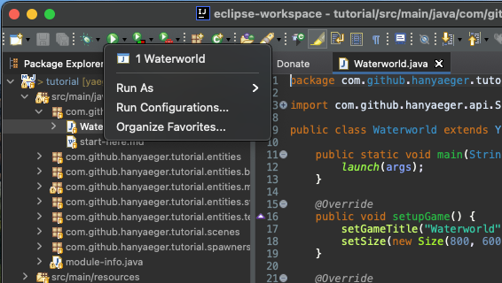
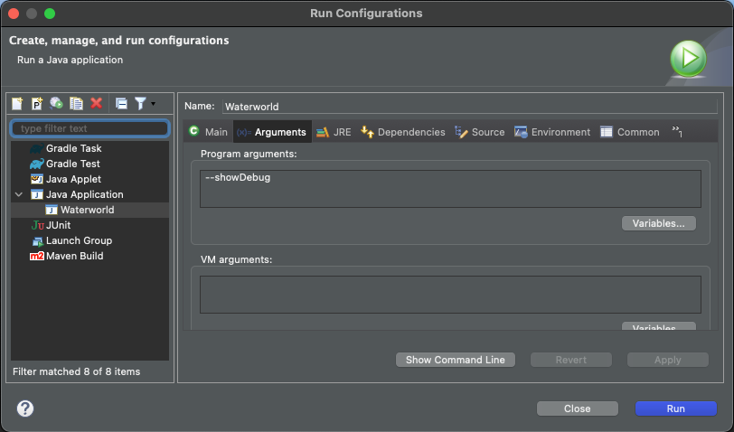

# Adding Dynamic Entities

<<<<<<< HEAD
Before adding Hanny, lets start by adding her enemy, the evil Swordfish. Since
this fish will be based on the image
`sprites/swordfish.png` and he will swim around, we will be using
a `DynamicSpriteEntity`.

## Add the `Swordfish`

 Create a new Class called `Swordfish` that
extends `DynamicSpriteEntity` in
package `com.github.hanyaeger.tutorial.entities`. Since the image of the
=======
Before adding Hanny, lets start by adding her enemy, the evil swordfish. Since
this fish will be based on the image `sprites/swordfish.png` and he will 
swim around, we will be using a `DynamicSpriteEntity`.

## Add the `Swordfish`

 Create a new class called `Swordfish` that
extends `DynamicSpriteEntity` in package 
`com.github.hanyaeger.tutorial.entities`. Since the image of the
>>>>>>> development
swordfish is already of the correct size, we don't need to set its size through
the constructor, which can now look like:

```java
public Swordfish(Coordinate2D location){
    super("sprites/swordfish.png", location);
}
```

<<<<<<< HEAD
Notice how we call `super()` and pass the *image*, the *location* and the *size*
to the constructor of the Super Class.

## Animate the `Swordfish`

Since the Swordfish is a `DynamicSpriteEntity`, we can let it move around the
Scene. To do this, we will need to set both the *direction* and *speed*. The *
direction* will be an angle in degrees, where 0 denotes upwards. For
convenience, Yaeger supplies a method to set both values at once. For the
trivial directions (up, left, right and down)
Yaeger provides an Enumeration called `Direction`, which can also be passed to
the method.
=======
Notice how we call `super(String, Coordinate2D)` and pass the *url* and  
*location* to the constructor of the super class.

## Animate the `Swordfish`

Since the swordfish is a `DynamicSpriteEntity`, we can let it move around the
scene. To do this, we will need to set both the *direction* and *speed*. The 
*direction* will be an angle in degrees, where 0 denotes upwards. For
convenience, Yaeger supplies a method to set both values at once. For the
trivial directions (up, left, right and down) Yaeger provides an Enumeration 
called `Direction`, which can also be passed to the method.
>>>>>>> development

 Add the following method-call to the constructor
of `Swordfish`, just after the call to `super`:

```java
setMotion(2, 270d);
```

<<<<<<< HEAD
 Now use the `setupEntities()` from the `GameLevel` to
add `Swordfish`.

 Run the game again. You should now see a Swordfish that
=======
 Now use the `setupEntities()` from `GameLevel` to
add `Swordfish`.

 Run the game again. You should now see a swordfish that
>>>>>>> development
swims from right to left and then disappears of the screen.

## Make the swordfish swim in circles

<<<<<<< HEAD
Now we would like to add behaviour that notifies us when the Swordfish has left
the Scene. That way we can place him to the right of the Scene, and make him
reappear and continue his path.

As seen before, adding behaviour is being done by implementing the correct
interface. In this case, Yaeger supplies the
interface `SceneBorderCrossingWatcher`.
=======
Now we would like to add behaviour that notifies us when the swordfish has left
the scene. That way we can place him to the right of the scene, and make him
reappear and continue his path.

As seen before, adding behaviour is being done by implementing the correct
interface. For this case, Yaeger supplies the interface 
`SceneBorderCrossingWatcher`.
>>>>>>> development

 Let `Swordfish` implement the
interface `SceneBorderCrossingWatcher` and implement the event handler in the
following way:

```java
@Override
public void notifyBoundaryCrossing(SceneBorder border){
    setAnchorLocationX(getSceneWidth());
}
```

 Run the game again and see what happens. To also change
<<<<<<< HEAD
the y-coordinate at which the Swordfish reappears, you can add the following
=======
the y-coordinate at which the swordfish reappears, you can add the following
>>>>>>> development
method-call: 
`setAnchorLocationY(new Random().nextInt((int) getSceneHeight()- 81));`
to the handler.

## Use the build-in debugger to see what is happening

Yaeger contains a simple debugger that displays how much memory is used by the
game and how many Entities are currently part of the game. When a game doesn't
work as expected, you can use this debugger to get some inside information.

 Run the game with the commandline argument 
`--showDebug`. Setting these options can usually be done from the Run 
<<<<<<< HEAD
Configuration in your IDE. When using IntelliJ, first select "Edit 
Configurations...":
=======
Configuration within your IDE, as explained below.
>>>>>>> development

See if you can relate the stated numbers to what you expect from your game. To
disable the Debugger window, just remove the commandline argument from the Run
Configuration.

### Setting commandline arguments from IntelliJ

When using [JetBrains IntelliJ](https://www.jetbrains.com/idea/), first 
select *Edit Configurations...*:


Add the commandline argument to the correct Run Configuration:


### Setting commandline arguments from Eclipse

When using [Eclipse](https://www.eclipse.org/), select *Run Configurations...*
from the toolbar:



Select the *Arguments* tab and edit the *Program Arguments*:

<<<<<<< HEAD
See if you can relate the stated numbers to what you expect from your game. To
disable the Debugger window, just remove the commandline argument from the Run
Configuration.
=======

>>>>>>> development
