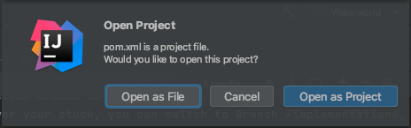
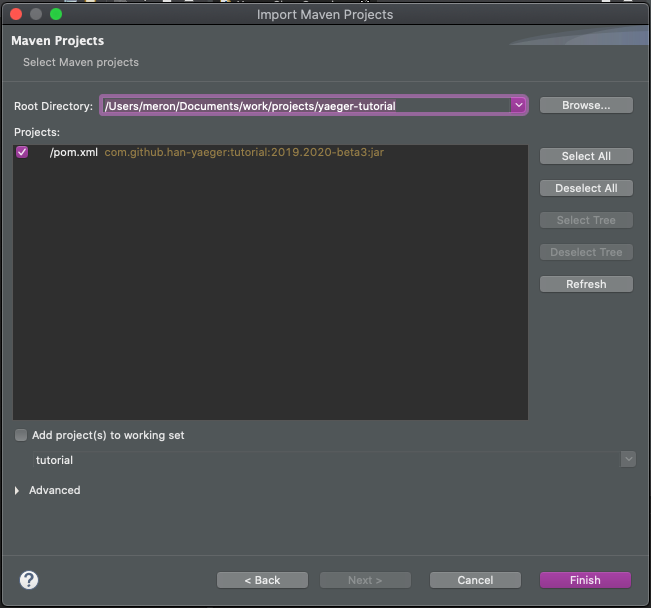

# Creating your first Yaeger game

We are going to create a game that consists of three scenes. A Title scene,
a Game Level scene and a Game Over scene. The Game itself will be about a fish
called Hanny, that swims in the ocean and tries to pop air bubbles. Sadly most
bubbles contain a poisonous gas and popping too many of those kills Hanny. Not
only Hanny swims in the ocean, but so does an evil Shark and Swordfish. If they
get their hands on Hanny, she gets eaten.

## Clone the starter project

We provide a [Git](https://git-scm.com/) repository, that contains both a 
starter project and the required assets. Either clone this repository to your 
local machine, or download the zip file. You can find the starter project here:
[https://github.com/han-yaeger/yaeger-tutorial](https://github.com/han-yaeger/yaeger-tutorial)

The project is a [Maven](https://maven.apache.org/) project, which will be
recognized by all modern IDE's. Knowledge of [Maven](https://maven.apache.org/) 
is therefore not required, but just to paint the full picture: you'll find a 
`pom.xml` file at the root of the project. This file contains the full project 
setup, and you will notice the dependency it has on`Yaeger`.

## Importing the Maven project into your favourite IDE

Since all modern IDE's can import a [Maven](https://maven.apache.org/) project,
it does not matter which you use. In this tutorial we focus on the two most
popular amongst Java developers: 
[JetBrains IntelliJ](https://www.jetbrains.com/idea/) and
[Eclipse](https://www.eclipse.org/).

### Importing the project in IntelliJ

1. Select *File > Open...*
2. In the **import window**, navigate to the project directory. Notice that this
   directory contains a `pom.xml` file. Select this `pom.xml` file and press 
   *Open*.
3. IntelliJ will notice that you are opening a `pom.xml` file and will ask if it
   needs to open the entire project:

   

   In the **Open Project Window** select **Open as Project**

### Importing the project in Eclipse

1. Select *File > Import...*
2. In the **import window**, expand *maven*, select *Existing Maven Projects*,
   and click *Next:*

   

3. Click *Browse* and select the project directory. Notice that this directory
   contains a `pom.xml` file:

   

## Switch branch to look at the solution

Whenever your stuck, you can switch to Branch *implementation*, to see the full
implementation. For switching branches some knowledge of 
[Git](https://git-scm.com/) is required, so read the [Git](https://git-scm.com/)
documentation to figure out how to switch branches.
