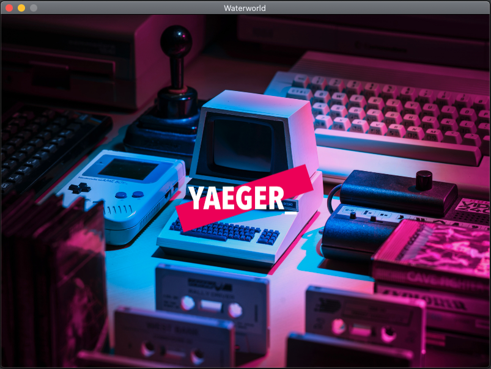

# Setting up a new game

Let's first create the entry-point, the class that contains the `main`-method.

 Create a class called `Waterworld.java` in the
package `com.github.hanyaeger.tutorial`.

  Let `Waterworld` extend the class `YaegerGame` and
implement the required methods. Leave them empty for now.

 Add a `main`-method that calls the static
method `launch()` from the class `YaegerGame`. Pass the arguments from
the `main`-method to the `launch`-method:

```java
public static void main(String[] args){
    launch(args);
}
```

 You now have a minimal Yaeger game. Run the
`main`-method to start the game. As you will notice, there is a default width
and height, and you'll be greeted with the Splash Screen. Since no Scenes have
been added, Yaeger exits after showing this Splash Screen.



## Set the width, height and title of the game

The game now uses the default size (width/height), which might be a bit small.
You can use the method `setupGame()` to set the size to a specific value.
Furthermore, you can set the title of the game, which will be shown as the title
of the window.

 Add the following body to the `setupGame()` method

```java    
@Override
protected void setupGame() {
    setGameTitle("Waterworld");
    setSize(new Size(800, 600));
}
```

The game has been set up, in the next step we will add the scenes and their
content.
